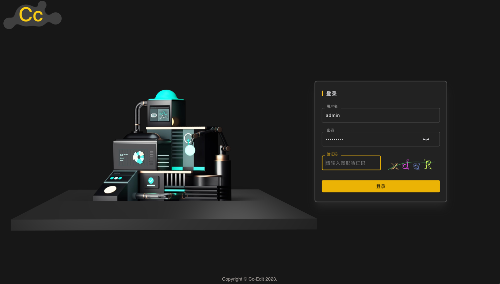
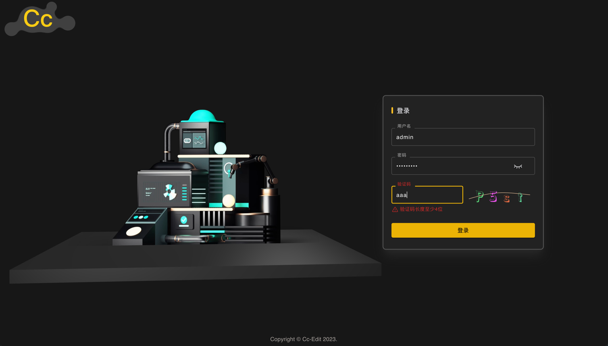
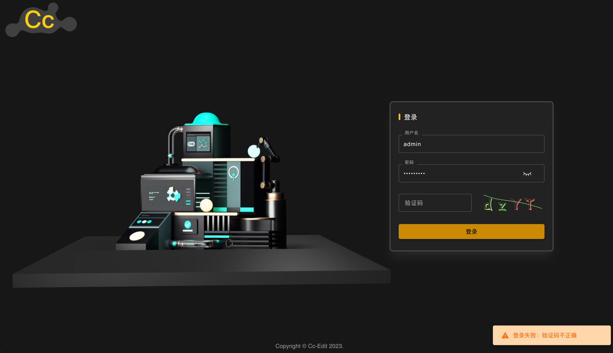
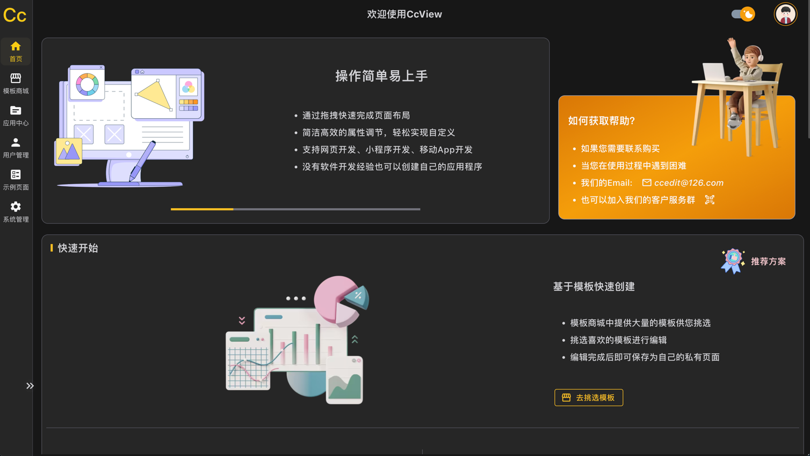
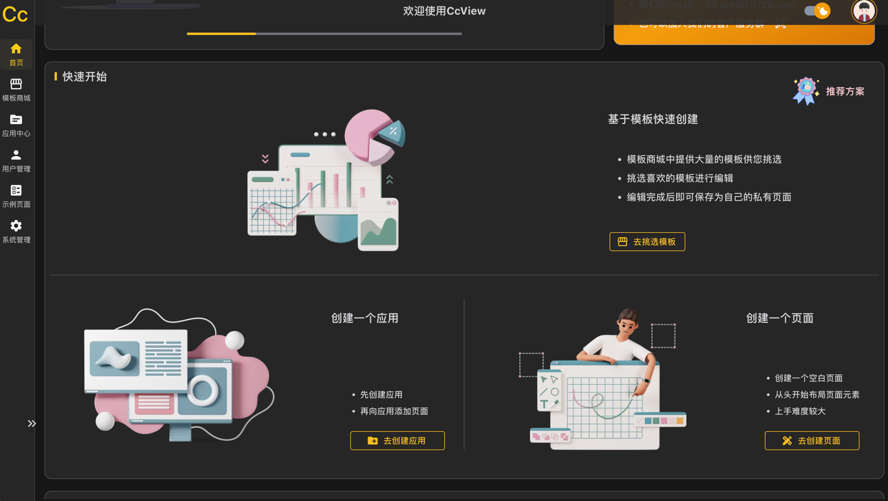
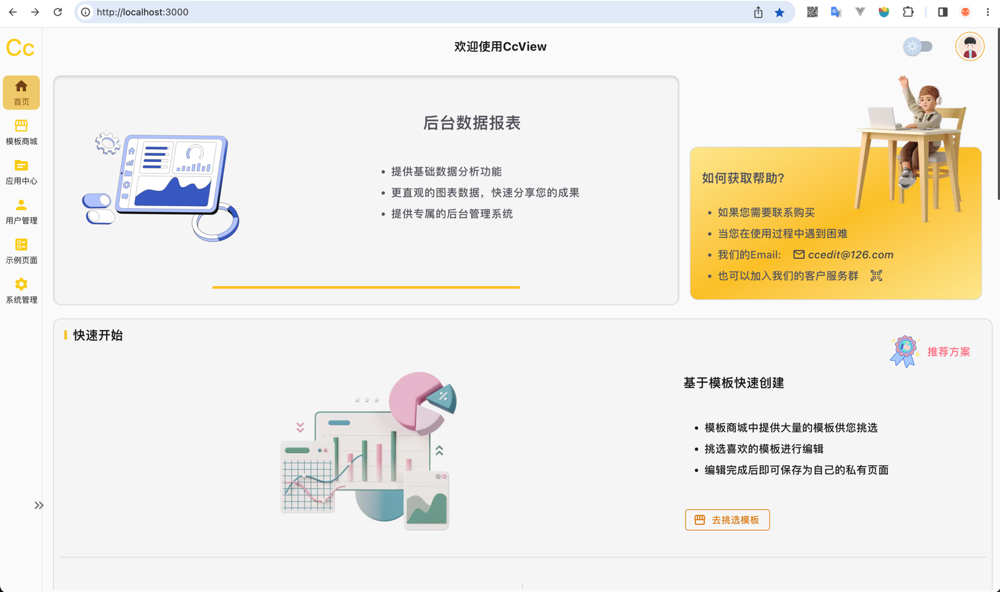

# CcView

## 代码权限
> 组件库以及编辑器使用git subModule的方式集成

## 本地运行  

> $ git clone --recurse-submodules https://github.com/Cc-Edit/CcView.git`    

或
>
> $ git clone https://github.com/Cc-Edit/CcView.git        
> $ git submodule update --init   

更新所有子模块    
> $ git submodule update --remote

本地运行：   

> $ yarn install   
> $ yarn dev

## 设计原则

### 数据驱动
整个应用的核心就是数据驱动，将所有可被抽象的逻辑全部抽象为 jsonSchema   
整个应用遵守配置化、描述化原则

## 核心

### JSON to Form 表单描述
表单的创建与校验，全部集中到配置文件中 [form](src/config/form)  
登录表单： [LoginForm.ts](src%2Fconfig%2Fform%2FLoginForm.ts)   

应用创建弹窗： [CreateApp.ts](src%2Fconfig%2Fform%2FCreateApp.ts)

表单回显(用于数据更新)： 

表单模板(所有基础表单元素示例) [TemplateForm.ts](src%2Fconfig%2Fform%2FTemplateForm.ts)

## 预览

#### 登录页面

> 视频透明背景播放  

#### 登录页面-表单校验

#### 登录页面-全局提示

#### 首页

####  应用列表

### 编辑器

#### 404页面

#### 500页面

#### 维护页面
`

### 版权
#### 插画与图标 [https://igoutu.cn/](https://igoutu.cn/)
#### 画板标尺 (基于 react18 翻新 mb-sketch-ruler )： [mb-sketch-ruler](https://github.com/mockingbot/mb-sketch-ruler)